

  <!-- IMAGE 01: the Row Health shield. Square transparent PNG, renders at 96px. -->
  

<h1 align="center">Row Health Campaign Category Analysis</h1>

  <em><strong>Which campaign categories are worth continuing to fund, and how do they compare on the metrics that matter to signups and to awareness?</strong></em>

  <a href="https://public.tableau.com/app/profile/desmond.chua1037/viz/RowHealthCampaignCategoryDashboard/CampaignCategoryDashboard"><strong>View the interactive dashboard</strong></a>
  &nbsp;·&nbsp;
  <a href="RowHealth_Documentation_and_Analysis.xlsx"><strong>Open the analysis workbook</strong></a>

A full analytics build for Row Health, a US medical insurance company: requirements decomposition, data profiling, metric definitions, a self-serve Tableau dashboard, and written findings across marketing, signups and claims.

---

## Project Background

Founded in 2016, Row Health is a medical insurance company serving thousands of customers across the United States. In 2019 the company launched a new set of marketing campaign categories spanning topics like wellness tips, plan affordability and preventative care. Customers sign up to one of four plans, bronze, silver, gold and platinum, each with different premiums and claim coverage rates.

Having hired a new data team and with next year's marketing budget under review, Row Health wanted to understand how effective those campaign categories have been and how they relate to signups and to the patient claims that follow. The brief came from Nick, Reporting and Insights Manager, ahead of a recurring quarterly business review, so the deliverable is a dashboard the marketing team can self-serve from rather than a one-off analysis.

Insights and recommendations are provided across three areas:

- **Marketing Performance:** spend, reach and click performance by campaign category, and how a category average changes once it is split by campaign type.
- **Signup Performance:** signup volume, rate, cost and mix by category and over time.
- **Claims Performance:** claim value, average claim size and how the claim book has shifted between categories.

**Links**

- Interactive Tableau dashboard: **[Row Health Campaign Category Dashboard](https://public.tableau.com/app/profile/desmond.chua1037/viz/RowHealthCampaignCategoryDashboard/CampaignCategoryDashboard)**
- Full documentation and analysis workbook: [`RowHealth_Documentation_and_Analysis.xlsx`](RowHealth_Documentation_and_Analysis.xlsx)

The workbook holds everything behind the findings below, including the requirements decomposition, the data profiling record, the metric definitions and the dashboard build log, plus the three unmodified source tabs.

> **A note on figures.** Every number in this README is computed from the supplied source tables and reconciles to them. Where a figure differs from the reference project this analysis was based on, the difference is stated and explained rather than resolved in favour of the reference. The reconciliation is documented in the workbook.

---

## Data Structure and Initial Checks

The dataset consists of three tables covering campaigns, customer signups and demographics, and the claims those customers went on to file. Total row count is 66,393 records across 57 campaigns, 16,338 customers and 49,998 claims, running from January 2019 to July 2023.

<!-- IMAGE 02: the ERD showing campaigns to customers to claims. Use the diagram from the brief. -->

  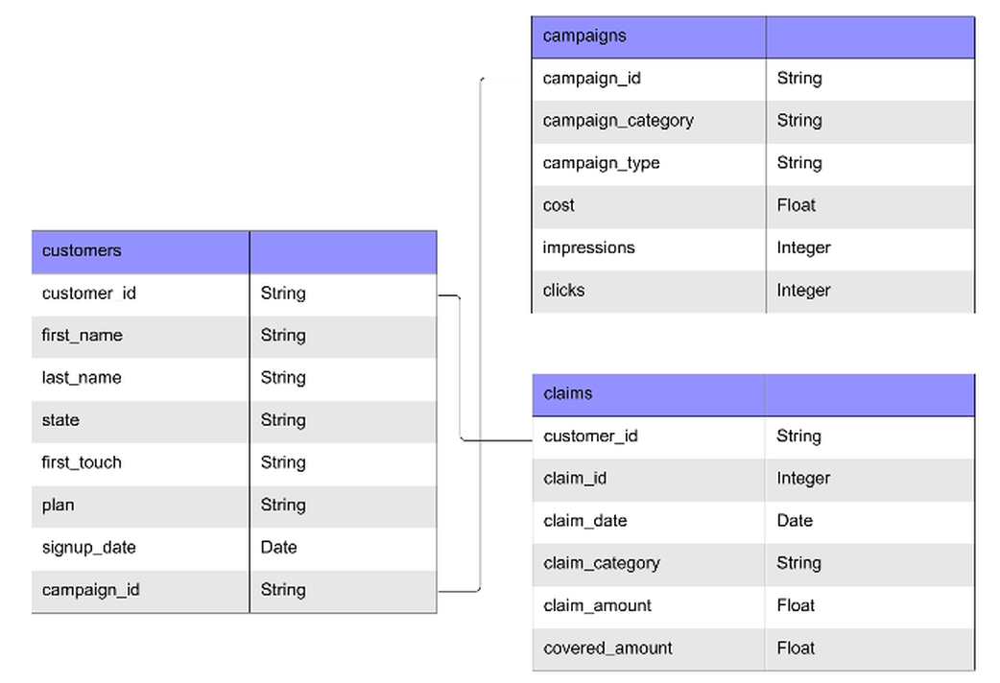

The three tables relate rather than join: `customers` is the only path between `campaigns` and `claims`. That matters, because it sets the grain rule that governs every metric in this project.

Before any analysis, the data was profiled using the CLEAN method: Conceptualize, Locate, Evaluate, Augment, Note. Structurally the data is clean. There are no duplicate rows, no duplicate keys, no leading or trailing spaces, no casing inconsistencies, no mixed types within a column, and referential integrity between claims and customers is complete in both directions. Analytically it is not. Eleven issues were logged, four of which change the numbers on a dashboard if they are not handled: the block of unattributed campaigns, the over-coverage rows, the claims fan-out on customer counts, and the partial 2023 year.

The full data dictionary, the eleven-item quality log with a decision and a rationale against each item, and the list of checks run and passed are on the **Documentation** tab of the workbook.

---

## Executive Summary

### Overview of Findings

Row Health spent **$60,190 across 57 campaigns** to acquire **16,338 customers**, who have since filed **49,998 claims worth $13,359,063**. Headline performance is a 9.39% click-through rate at $0.071 a click, and a 0.18% signup rate at $3.68 a signup.

<!-- IMAGE 04: the callout row from the top of the dashboard, showing CTR, CPC, Signup Rate, Cost per Signup. -->

  

Three things are worth knowing.

**Marketing.** The categories that bought the most impressions converted worst. Click-through rate runs from 25.48% on Health For All, the smallest category by impressions, down to 1.41% on Golden Years Security, and a category average can hide two campaign types pulling in opposite directions.

**Signups.** Row Health acquired 16,338 customers at $3.68 each, but the largest movement in the data was not a campaign result. Signups stepped up across every category at once in March 2020 and have since returned to roughly the 2019 baseline.

**Claims.** Claims follow the size of the customer base rather than current campaign performance, peaking two years after signups did. Compare Health Coverage now holds 37.6% of the claim book and its customers claim $1,383.7 each against an $818 average.

---

## The Dashboard

<!-- IMAGE 05: full dashboard screenshot, all three bands, at readable width. -->

  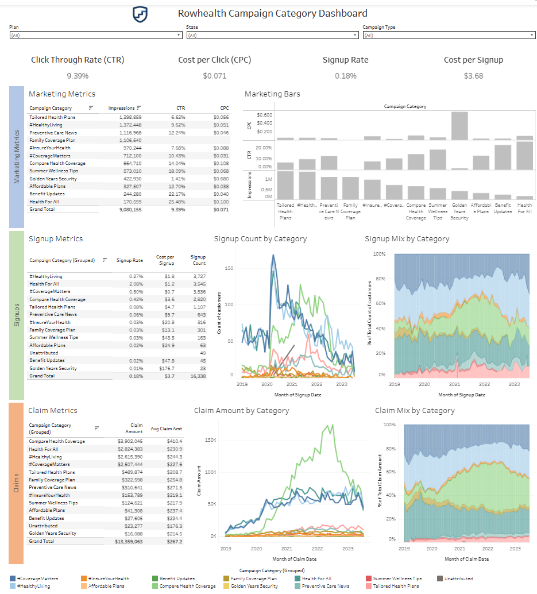

**[View the interactive dashboard on Tableau Public](https://public.tableau.com/app/profile/desmond.chua1037/viz/RowHealthCampaignCategoryDashboard/CampaignCategoryDashboard)**

Twelve worksheets across three subject bands following the customer journey: marketing, then signups, then claims. Tables on the left, visuals on the right, repeated in every band, so a reader who learns to read the first band can read the other two without being taught again.

Three filters: Plan, State and Campaign Type. **Plan and State are deliberately scoped to 8 of the 12 worksheets rather than to all of them.** Cost, impressions and clicks are recorded once per campaign, and nothing in the data records which impressions reached which person. Applying a customer attribute to a campaign-level sheet forces Tableau to evaluate campaigns through the customers table, and the 24 campaigns with no attributed customers drop out. In testing, total campaign cost fell from $60,190 to $35,481 while every filter control still read `(All)`. Nothing on screen indicated a problem.

The rule this generalises to: a filter can only be trusted on a chart at the same grain as the filter. The full scope decision, the per-sheet filter map and the standing regression test are on the **Dashboard Build Log** tab.

---

## Marketing Performance

*How much did we spend, what did it buy, and which categories performed?*

<!-- IMAGE 06: Marketing Metrics table, impressions / CTR / CPC by category. -->

  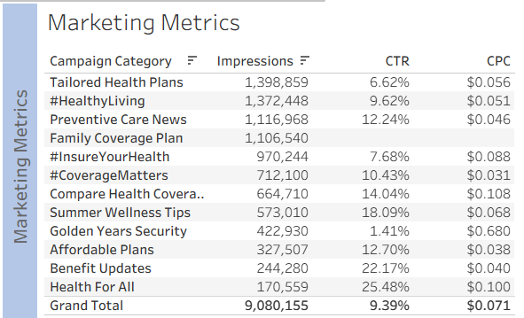

- **Click-through rate averages 9.39% across $60,190 of spend, but ranges from 25.48% on Health For All to 1.41% on Golden Years Security.**
- **The biggest campaigns are not the best ones.** Tailored Health Plans took the most impressions at 1,398,859 and returned 6.62%. Health For All took the fewest at 170,559 and returned 25.48%.
- **Golden Years Security is the worst on both measures**, at 1.41% CTR and $0.680 per click against a $0.071 average.

<!-- IMAGE 07: Marketing Bars, sorted, showing impressions / CTR / CPC together. -->

  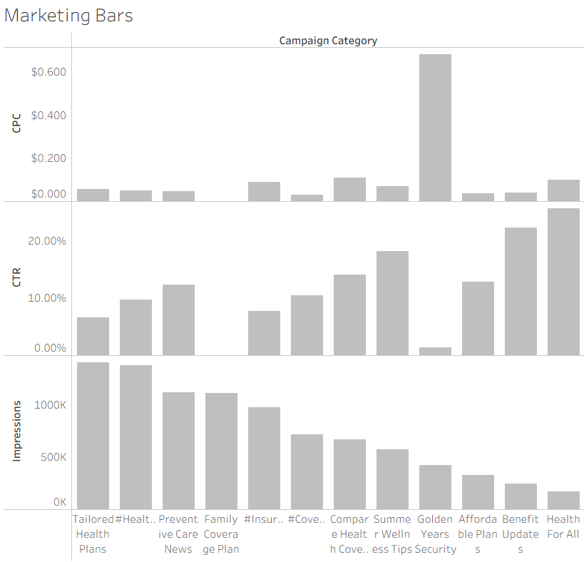

- **Family Coverage Plan spent $3,936 on 1,106,540 impressions and recorded no clicks at all.** Every other campaign with no clicks carries an explicit zero, so this reads as a tracking failure rather than a measured result.

<!-- IMAGE 08: Marketing Metrics by Type, category split by campaign type. -->

  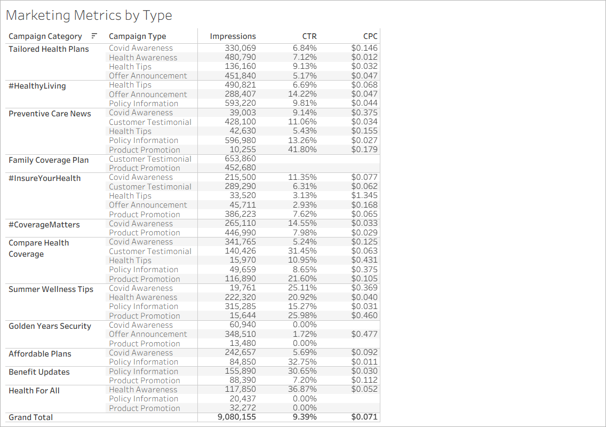

- **Health For All's 25.48% CTR is one campaign type.** Health Awareness returned 36.87%; its other two types returned 0.00%.
- **Benefit Updates splits the same way**: Policy Information 30.65%, Product Promotion 7.20%.

> **Caveats on this section.** 9 of 57 campaigns carry no click figure, covering $8,310 of spend and 1,263,299 impressions; three are blank and six are recorded as zero, and blanks were left blank rather than filled with zero. Campaigns have no date column, so nothing here can be read as a trend. Some campaign type figures sit on very small impression counts: Preventive Care News shows 41.80% CTR on Product Promotion, but that is 10,255 impressions, a tenth of one percent of the total.

---

## Signup Performance

*How many customers did each category bring in, when, and at what cost?*

<!-- IMAGE 09: Signup Metrics table, signup rate / cost per signup / signup count by category. -->

  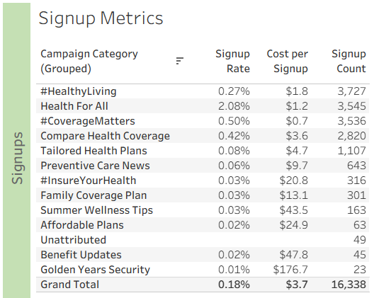

- **Row Health acquired 16,338 signups at a 0.18% signup rate and $3.68 per signup.**
- **Four categories produced 83% of all signups**: #HealthyLiving 3,727, Health For All 3,545, #CoverageMatters 3,536 and Compare Health Coverage 2,820.
- **Health For All converts far better than anything else**, at 2.08% against the 0.18% average, and costs $1.2 per signup.
- **Golden Years Security produced 23 signups at $176.7 each**, against $0.7 for #CoverageMatters.

<!-- IMAGES 10 and 11: overall shape on the left, category detail on the right. -->

  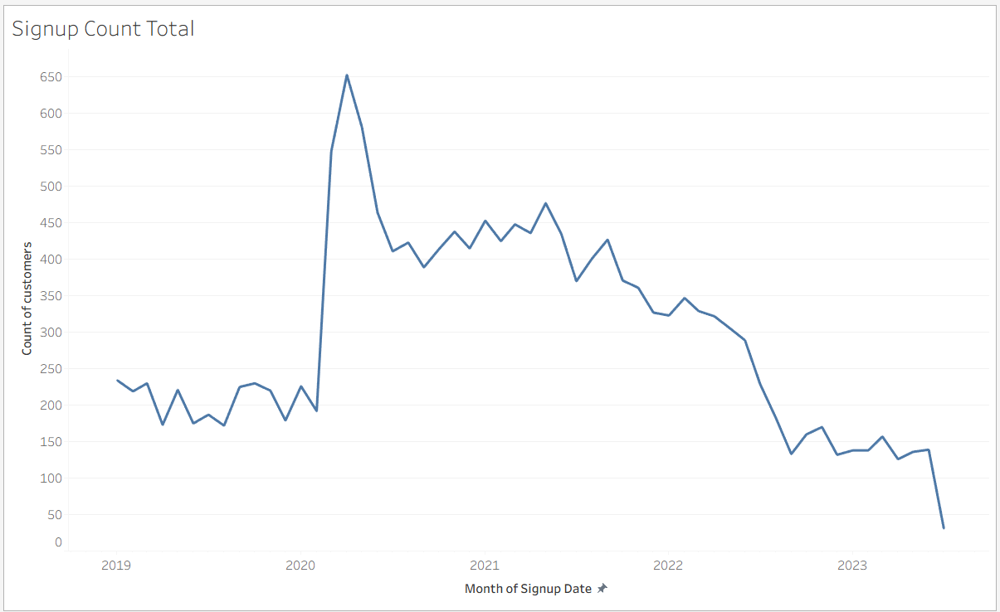

  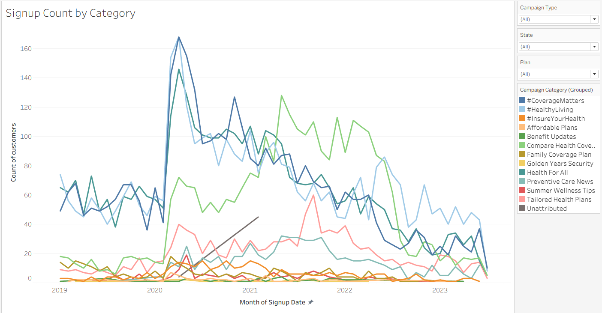

- **Signups averaged 205 a month through 2019, stepped up to 548 in March 2020 and peaked at 653 in April**, then declined. The six complete months of 2023 average 139.
- **The March 2020 step appears in every major category at once rather than in one**, so it is unlikely to be campaign-driven. The timing matches the start of the Covid pandemic, though nothing in this data confirms the cause.
- **Annual signups peaked at 5,154 in 2020 and fell to 2,923 in 2022, a 43% drop.**

<!-- IMAGE 12: Signup Mix by Year, stacked bars, percent of total. -->

  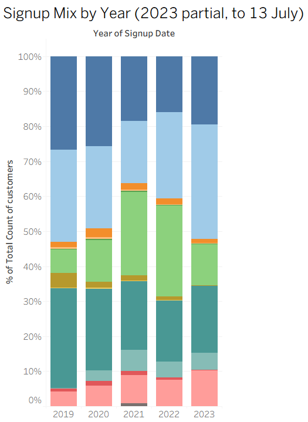

- **In 2019 three categories were roughly level at around 27% of signups each**: Health For All, #CoverageMatters and #HealthyLiving. Compare Health Coverage was a minor category at 6.7%.
- **By 2022 Compare Health Coverage was the largest at 26.1%**, growing from 165 signups to 762.
- **Health For All and #CoverageMatters both fell in share and in count.** Health For All went from 28.5% to 17.5%, and 702 signups to 512. #CoverageMatters went from 26.8% to 16.0%, and 660 to 468.
- **#HealthyLiving's share fell from 26.3% to 24.7%, but its signups rose from 648 to 721.** Share can drop while a category grows if the total is falling.

> **Caveats on this section.** 49 signups have no campaign attached and show no signup rate or cost per signup; ten carry the text "unknown" and 39 are blank, and both are kept in the 16,338 total as Unattributed. 24 campaigns produced no signups but carry $24,709 of spend, 41% of the total, which sits in the numerator of every cost per signup figure while contributing nothing to the count, so all cost per signup values are inflated. Signup rate and cost per signup combine customer counts with campaign impressions and cost, so both are sound at `(All)` and unreliable under a Plan or State filter. 2023 covers six and a half months, to 13 July.

---

## Claims Performance

*What did customers from each category go on to claim?*

<!-- IMAGE 13: Claim Metrics table, claim amount / average claim / claim count by category. -->

  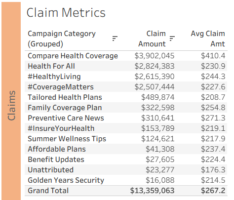

- **Customers filed 49,998 claims worth $13,359,063, averaging $267.2 a claim.**
- **Compare Health Coverage claims the most at $3,902,045, but it does not file the most claims.** Health For All files 12,232 against its 9,507 and claims $1.1m less.
- **The difference is claim size.** Compare Health Coverage averages $410.4 a claim against $230.9 for Health For All and $267.2 overall.
- **Golden Years Security produced 75 claims worth $16,088**, the smallest book of any category.

<!-- IMAGE 14: Claim Amount by Category, monthly line. -->

  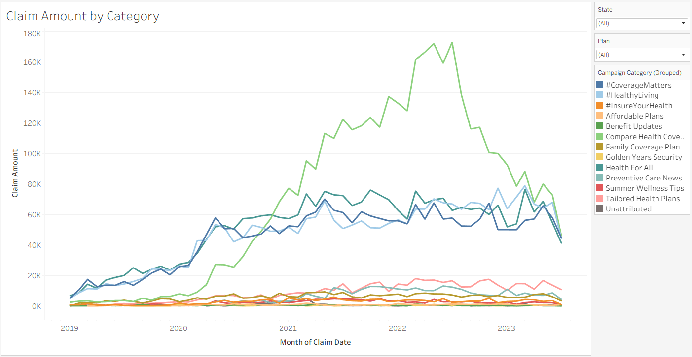

- **Claims grew from $710,923 in 2019 to $4,428,738 in 2022, a sixfold rise.** Monthly claim amount peaked at $424,619 in May 2022.
- **Signups peaked in April 2020 and claims peaked two years later.** Customers keep filing after they join, so claim volume follows the size of the customer base rather than current campaign performance.
- **Compare Health Coverage drove the rise.** Its monthly claim amount went from near zero in 2019 to roughly $173,000 at its 2022 peak.

<!-- IMAGE 15: Claim Mix by Year, stacked bars, percent of total. -->

  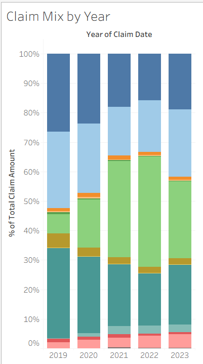

- **In 2019 three categories split the claim book roughly evenly**: Health For All 30.7%, #CoverageMatters 26.4% and #HealthyLiving 26.1%. Compare Health Coverage held 6.5%.
- **By 2022 Compare Health Coverage held 37.6%, more than double the next largest.** It rose from $46,407 to $1,667,120 in claim amount.
- **Health For All, #CoverageMatters and #HealthyLiving all fell in share while holding or growing in dollars.** Health For All went from 30.7% to 17.7% of the claim book, but from $218,119 to $785,084.
- **Compare Health Coverage also grew from 6.7% to 26.1% of signups over the same period.** Row Health acquired more customers through that category, and those customers file larger claims.

> **Caveats on this section.** 132 claims worth $23,277 belong to customers with no campaign attached and sit in the totals under Unattributed. 64 claims are recorded at exactly $0.00, moving the overall average from $267.53 to $267.19. 2023 covers seven months, to 27 July: the yearly view shows $2,015,450 against $4,428,738 for 2022, but the six complete months of 2023 run between $287,688 and $338,791 against a 2022 monthly average of $369,061, so this is an incomplete year rather than a collapse. 1,349 rows show a covered amount above the billed amount, 2.7% of claims and $34,249 in total, too small to affect category comparisons but the field needs checking.

---

## Recommendations

Written in the form *because [finding], we should [action]*, so the evidence travels with the action.

1. **Move budget out of the five categories converting above $18 a signup and into the four converting below $1.50.** Of the $35,481 of spend that can be traced to a customer, four categories take 36.6% and return 83.7% of all signups at $0.95 each: Health For All, #CoverageMatters, #HealthyLiving and Compare Health Coverage. Five take 32.6% and return 3.7% at $18.94 each: Summer Wellness Tips, #InsureYourHealth, Affordable Plans, Benefit Updates and Golden Years Security. Roughly a third of the traceable budget is producing under four percent of the customers. Yield is unlikely to hold linearly as spend scales into the better categories, so the case here is the floor rather than the ceiling: almost any reallocation improves on $18.94.

2. **Fund Health Awareness campaigns within Health For All, not the category as a whole.** Health For All's 25.48% click-through rate comes entirely from its Health Awareness campaigns while its other two types returned 0.00%, and it converts at 2.08% against a 0.18% average at $1.2 a signup.

3. **Stop funding Golden Years Security rather than trying to improve it.** It is worst on every measure: 1.41% click-through rate, $0.680 a click, 23 signups at $176.7 each, and the smallest claim book at $16,088.

4. **Compare Compare Health Coverage's premium income against its claim cost before growing it further.** It has grown from 6.7% to 26.1% of signups and from 6.5% to 37.6% of the claim book, and its customers claim $1,383.7 each against an $818 average.

5. **Set 2024 targets against the 2019 baseline of 2,465 signups rather than the 2020 peak.** The March 2020 step appears across every category at once rather than in any single one, so the 2020 and 2021 signup levels should be treated as an external effect rather than a campaign result.

6. **Confirm whether click tracking was working on Family Coverage Plan before treating it as a failure.** It spent $3,936 on 1,106,540 impressions with no clicks recorded at all, while every other campaign without clicks carries an explicit zero.

7. **Report claim amount per customer alongside the totals**, so category comparisons are not driven by how many customers each category brought in.

---

## Assumptions and Caveats

**Two definitional decisions were closed before the build.** Signup rate is measured over impressions, not clicks, which gives 0.18% rather than 1.92% and reads the whole funnel rather than only the step after the click. Cost per click is used in place of the cost per impression named in the brief, at $0.071 rather than $0.0066. In both cases the published callout was taken as the tiebreaker over the spoken definition, on the basis that the published figure is the one people have already seen and will quote back. Both are recorded on the **Metric Definitions** tab.

**Cost per acquisition is inflated for the dataset as a whole.** 24 of the 57 campaigns have no customers attributed to them, and they are contiguous, CAM034 through CAM057, which points to an extract or attribution gap rather than 24 campaigns that genuinely failed. They carry $24,709 of spend, 41% of the total, which sits in the numerator of every cost per signup figure while contributing nothing to the count. Excluding them gives $2.17 a signup rather than $3.68. Both figures are correct for what they measure; $3.68 is reported because it reconciles to the full source.

**Claim amount is what providers billed, not what Row Health paid.** Row Health covered $8,169,760 of the $13,359,063 billed, 61.2%, and coverage rates differ by plan, so a category's real cost depends on which plans its customers hold. Nothing in this analysis says whether these customers are profitable.

**Four limits noted in the sections above hold throughout.** Return on ad spend over time cannot be measured, because the campaigns table has no date column. Marketing performance cannot be sliced by plan or state, because nothing in the data records which impressions reached which person. Signup rate and cost per signup cross two grains and are reliable only at `(All)`. 2023 is partial in both signups and claims, ending 13 and 27 July respectively.

---

## Technical Process

- **Profiling and quality assessment** in Excel and Python, using the CLEAN method. Eleven data quality issues logged with a decision and a rationale against each. The three source tabs were left unmodified.
- **Requirements decomposed before anything was built**: the ask, the big question, five business questions traced back to the stakeholder brief, then the metrics and dimensions that answer them.
- **Metrics defined once, as ratios of aggregates.** No derived column was added to any source tab, because a ratio of aggregates cannot be a row-level column: writing clicks over impressions per row and then totalling gives the sum of rates rather than the rate of the sums. Every derived field is a Tableau calculated field.
- **Dashboard built in Tableau Public**: twelve worksheets, three subject bands, filter scope restricted by grain and regression-tested after every scope change.
- **Findings written in Excel** against the pasted dashboard visuals, so every number in an insight is readable off the visual directly above it. Every figure reconciles to source.

---

## Repository Contents

| File | What it holds |
|---|---|
| `README.md` | This document |
| `RowHealth_Documentation_and_Analysis.xlsx` | The full workbook, eleven tabs |
| `images/` | Dashboard screenshots and figures used above |

**Inside the workbook**

| Tab | What it holds |
|---|---|
| Executive Summary | Headline figures, the answer to each subject area, recommendations, and what the analysis cannot tell you |
| Requirements | The stakeholder ask decomposed: big question, five business questions, agreed metrics and dimensions, layout, and what is out of scope |
| Documentation | Metadata, grain, data dictionary, the eleven-item quality log, derived fields, and the filter scope decision |
| Metric Definitions | Every metric defined once: plain-English meaning, calculation, valid grain, live value, and caveats |
| Dashboard Build Log | What was built and every decision taken while building it, with verified totals and per-sheet filter scope |
| Marketing Metrics / Signup Metrics / Claim Metrics | The three analysis tabs, with visuals, insights and recommendations |
| customers / claims / campaigns | The three source tabs, unmodified |

---

  <!-- IMAGE 01 again, smaller. Same file as the header, no second export needed. -->
  
   
  <em>Built by Desmond Chua. Analysis in Excel and Tableau Public.</em>

